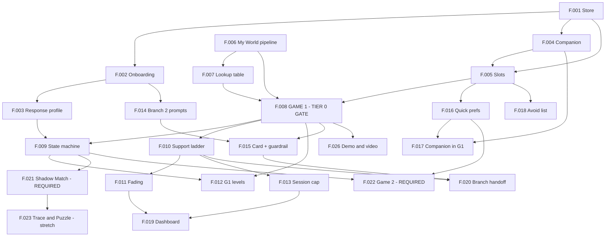

# F.000 — Build Index

Rebuilt against **`app-guide-v3-FINAL.md`**. That document is the single source
of truth; everything here serves it. Section refs (§) point at it.

**This table's Status column is what's actually done.** Update your own rows.

---

## The gate that matters

> **§16.4: Tier 0 must exist by Saturday night. If it slips, you are in
> Option B whether you've called it or not.**

The team is building **Option A** — full scope, ordered so every cut is clean.
Option B (Tier 0+1+2, surplus hours spent on polish and testing) is a **free
fallback**, because the two are identical up to Tier 2. Reverting costs nothing.

Three conditions make the fallback real:
1. **Checkpoint after Tier 1** — complete? If no, freeze scope and consolidate.
2. **Nothing half-built is ever visible.** Above Tier 1, feature-flag or branch.
3. **The video is owned from the start** (F.026, P3).

**The trap:** "we can always revert" is not permission to over-reach early. The
fallback protects against running out of time, not against building the wrong
things first. **Build in tier order, always.**

---

## Assumptions I made

The guide doesn't state these; correct them if wrong.

- **Team of 4** — carried from the original brief.
- **Mobile web (PWA)** rather than a native app — see
  `../engineering/TECH-DECISIONS.md`. Meets §4's tablet-and-phone-touch
  requirement, native camera included, and deploys instantly for judges.

## Scope decision — all three games ship

**Overriding §16.1's default here.** The guide's own tiering treats Game 2 and
Game 3 as optional, cut-first-without-discussion, on the finding in §16.3 that
a second and third game move judging scores least. The team has decided
otherwise: **all three games are required this weekend, not optional.**

What that changes concretely:
- **F.021 (Game 3, Mode A) and F.022 (Game 2)** move from Tier 3 to **Tier 2 —
  required.** Not conditional on a Sunday checkpoint; scheduled like everything
  else in Tier 2.
- **F.023 (Game 3, Modes B & C)** moves from "spec only, do not build" to a
  real Tier 3 file with an owner (P2) — genuinely stretch, built only if F.021
  is done and tested first, and still the first thing cut if the weekend runs
  long.
- **The honest tradeoff, stated plainly rather than buried:** this removes the
  scope-safety margin §16.4's tiering was built to protect. There is now more
  required work competing for the same three days, and the Tier-1 freeze
  checkpoint in `BUILD-ORDER.md` still governs — if Tier 1 isn't done, that
  checkpoint fires and the team freezes scope regardless of this decision.
  **The real fallback under this new scope is F.023, not Game 2 or Game 3
  Mode A.** If something has to give, it's Trace and Puzzle, not a whole game.

---

## Tiers

| Tier | Meaning |
|---|---|
| **0** | The floor. If only this exists you still have a working, novel, demoable product |
| **1** | The credible product. **This is the version that competes for the track** |
| **2** | The differentiators |
| **3** | Stretch — has a real owner, built only after its Tier 2 dependency is done and tested. First thing cut if time runs short |
| **4** | **Do not start.** Spec only — evidence for the modular claim |

Note: F.021 and F.022 were Tier 3 by the guide's own default (§16.1) and are
**Tier 2 here** — see "Scope decision" above.

---

## All files

| # | Title | Tier | Owner | Reviewer | Status | Depends on |
|---|---|---|---|---|---|---|
| F.001 | Device store & profile model | 0 | P1 | P3 | Implemented, awaiting review | — |
| F.002 | Shared onboarding: age, two doors | 0 | P4 | P1 | Not started | F.001 |
| F.003 | Response profile: 4 questions | 0 | P4 | P1 | Not started | F.001, F.002 |
| F.004 | Companion capture | 0 | P4 | P1 | Not started | F.001 |
| F.005 | Slot system | 0 | P1 | P3 | Implemented, awaiting review | F.001, F.004 |
| F.006 | My World pipeline | 0 | P2 | P4 | Not started | — |
| F.007 | Object → skill → steps lookup | 0 | P3 | P2 | Not started | F.006 (shape only) |
| **F.008** | **Game 1, one level** ← **GATE** | **0** | **P2** | **P4** | Not started | F.005, F.006, F.007 |
| F.009 | Interaction state machine | 1 | P1 | P3 | Implemented, awaiting review | F.003, F.008 |
| F.010 | Support ladder & logging | 1 | P1 | P3 | Not started | F.001, F.008 |
| F.011 | Fading logic | 1 | P1 | P3 | Not started | F.010 |
| F.012 | Game 1 levels 1–4 | 1 | P2 | P4 | Not started | F.008, F.009 |
| F.013 | Session cap, fade, handoff | 1 | P1 | P3 | Not started | F.008, F.010 |
| F.014 | Branch 2: milestones + prompts | 1 | P3 | P2 | Not started | F.001, F.002 |
| F.015 | Branch 2: card + guardrail | 1 | P3 | P2 | Not started | F.014, F.008 |
| F.016 | Context profile: quick prefs | 2 | P4 | P1 | Not started | F.001, F.005 |
| F.017 | Companion mechanic in Game 1 | 2 | P2 | P4 | Not started | F.004, F.008, F.016 |
| F.018 | Avoid list | 2 | P4 | P1 | Not started | F.005 |
| F.019 | Caregiver dashboard | 2 | P4 | P1 | Not started | F.010, F.011, F.013 |
| F.020 | Branch handoff & no-screening | 2 | P3 | P2 | Not started | F.010, F.015 |
| **F.021** | **Game 3 Mode A: Shadow Match** | **2 — required** | **P2** | **P4** | Not started | F.008, F.009 |
| **F.022** | **Game 2: Sequencing + routines** | **2 — required** | **P1** | **P3** | Not started | F.008, F.009, F.016 |
| F.023 | Game 3 Modes B & C | 3 — stretch | P2 | P4 | Not started | F.021 |
| F.024 | Generalization re-testing | 4 | — | — | **Spec only** | — |
| F.025 | Social story sub-flow | 4 | — | — | **Spec only** | — |
| F.026 | Demo, video & submission | — | P3 | P4 | Not started | F.008 |

Status: `Not started` / `In progress` / `In review` / `Done`.

---

## Dependency graph



**Critical path to the Tier 0 gate:**
`F.006 → F.007 → F.008` and `F.001 → F.005 → F.008`.
Two chains, two people, converging on Game 1.

**Start immediately, zero dependencies:** F.001 (P1) and F.006 (P2).

---

## How the work is split

| Person | Owns | Why |
|---|---|---|
| **P1** | Engine core, **then Game 2** — store, slots, state machine, ladder, fading, session cap, then Toy Story Sequencing | One head on the shared state model first — §7.7's state machine is the highest-scrutiny code in the build. Game 2 is scheduled *after* that chain is frozen, not competing with it |
| **P2** | Perception + Game 1 + Game 3 — pipeline, Game 1, levels, Companion in-game, then Shadow Match, then Trace/Puzzle if time allows | The camera and the demo centrepiece come first. §17 budgets half a day for the face-blur spike alone. Game 3 reuses the same crop/silhouette machinery P2 already owns, so it's a natural extension rather than new territory |
| **P3** | Lookup table → Branch 2 → **video** | The lookup table is content authoring, parallelisable on day one. Branch 2 is structurally separate. Then §16.4's instruction: whoever finishes Branch 2 moves to video |
| **P4** | Onboarding, profiles, Companion capture, context, avoid list, dashboard | Everything the parent fills in, plus the Companion — the differentiator — and the caregiver view |

**Tier 0 load:** P1 ×2, P2 ×2, P3 ×1, P4 ×3. P4 carries the most Tier 0 files
but three of them are small forms. **P3 finishes Tier 0 early by design** and
should float onto whatever is behind before starting Branch 2.

**With all three games required, P1 and P2 each carry a second build phase
that used to be optional.** Both are sequenced to start only once each
person's own Tier 0/1 chain is frozen — Game 2 and Game 3 don't compete with
the engine or with Game 1 for the same hours, they follow them. That's the
whole reason this redistribution is survivable rather than just more work
piled onto an already-full plate.

## Review pairings

```
P1 → reviewed by P3 → reviewed by P2 → reviewed by P4 → reviewed by P1
```

A one-way cycle: nobody reviews their own work, nobody rubber-stamps a partner.
**P3 reviews the engine** — they own Branch 2's restraint rules and F.020's
no-screening rule, so they have the clearest head for spec compliance and no
stake in the engine's implementation.

**Two standing checks on every review**, whatever the file:
1. Does it import a vendor SDK outside `src/adapters/`?
   (`../engineering/ARCHITECTURE-RULES.md`)
2. Does it violate §13 — a score, a face analysis, a diagnosis hint, a judgement
   about the home?

---

## Open decisions (§21)

1. **Project name.** Tied to regional framing — resolve that first.
2. **Regional framing** (§15): Indonesian context / Australian context /
   locale-configurable. **This changes Branch 2's referral data and the pitch's
   Impact framing.** Pick one and say it in the video.
3. **Branch 2 referral data** — real and verifiable, or clearly-marked
   placeholder. Never present placeholder service info as real.
4. **Speak to an early-childhood educator or OT?** Fifteen minutes materially
   strengthens Impact and Feasibility. Best question: *"When a child gets
   something wrong, what do you actually do?"* — their answer will sharpen §7.7
   more than any paper.

**Already closed in §0 — do not reopen:** age band 3–5 · tablet and phone,
touch · full phone parity · diagnosis never required · one demo profile
(calm/sameness/minimal words) · Branch 1 Game 1 as the live demo · Branch 2 as a
hardcoded walkthrough · Game 3 as three modes · guided prompts not voice ·
Option A with Option B as fallback.
